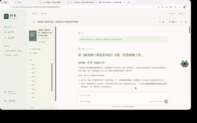

# 问书 · Ask Book

**把电子书转化为可复用的 AI 知识 Skill，让阅读成为随时可以继续的对话。**

问书是一个单用户本地 AI 阅读应用。导入电子书后，系统提炼核心框架、概念、方法、决策规则与适用边界；问答时先读取相关 Skill，再按需检索原书，让回答可以追溯到真实章节和段落。

前端使用 Vue 3、TypeScript、Pinia 与 Vite，后端使用 FastAPI 与 SQLite FTS5。支持桌面和移动端浏览器，通过本地服务运行。

## 实例演示



从添加书籍、生成知识 Skill，到围绕书籍提问和追溯原文，演示展示了问书的主要使用流程。

首次使用也可以添加《阅读的复利 · 功能示例》体验文件阅读与原文浏览。这是人工编写的原创示例，非真实出版物；AI 问答仍需要配置模型。

## 主要功能

- **电子书导入**：支持 EPUB、文本型 PDF、TXT 和 Markdown，提取书籍元数据与章节；EPUB 支持封面与目录顺序。
- **Book-to-Skill 转换**：按片段、章节、全书分层分析，根据小说、商业、技术、历史等类型生成适配的知识文件。
- **结构化知识**：核心 `SKILL.md`、按需章节知识、主题与章节索引，以及术语表、方法集、决策速查表等支持文件。
- **学习目的选择**：综合理解、实践应用、心智模型思考或精简参考，使用对应的章节深度与内容预算。
- **暂停与继续**：保存生成检查点，恢复时复用已完成的分析；支持重新生成。
- **可追溯问答**：区分本书观点、模型分析与补充背景，引用可跳转至真实原文段落和完整章节。
- **知识检索**：SQLite FTS5 / BM25 中文检索；可选同一服务商的 Embedding 混合检索。
- **Skill 查看与交换**：浏览 Markdown 或源文件、搜索知识、点击内部索引、导入与导出 `.skill.zip`。
- **阅读工作台**：每本书的多会话、历史记录、会话重命名与删除、读书笔记，以及最多 5 本书的联合问答。
- **学习辅助**：在对话中生成比较分析、行动计划、学习计划、检查清单、闪卡和阅读测验。

## 快速开始

### 环境要求

- Python 3.10 或更高版本。
- Node.js 20 或更高版本及 npm。
- 可选：[uv](https://docs.astral.sh/uv/) 用于创建 Python 虚拟环境和安装依赖。
- 一个兼容 OpenAI `chat/completions` 接口的模型服务。也可连接本地模型服务。

### 克隆并启动

在 macOS、Linux 或支持 Bash 的环境中执行：

```bash
git clone https://github.com/ns2250225/ask-book.git
cd ask-book
./run.sh
```

脚本创建 `.venv`，根据 `requirements.lock` 安装后端依赖，根据 `frontend/package-lock.json` 安装前端依赖并构建页面，最后启动本地服务。

打开 [http://127.0.0.1:8000](http://127.0.0.1:8000)。需要修改端口时：

```bash
BOOKSKILL_PORT=8002 ./run.sh
```

### 手动安装与启动

```bash
python3 -m venv .venv
source .venv/bin/activate
python -m pip install -r requirements.lock
npm --prefix frontend ci
npm --prefix frontend run build
python -m uvicorn backend.main:app --host 127.0.0.1 --port 8000 --no-access-log
```

Windows 下使用 `python` 创建虚拟环境，并通过 `.venv\Scripts\Activate.ps1` 在 PowerShell 中激活；其余 npm 和 Python 命令保持一致。

## 使用流程

1. **配置模型**：进入「AI 模型设置」，填写 API 基础 URL、API Key 和 Model，测试连接后保存。URL 应指向接口基础地址，例如以 `/v1` 结尾，无需附加 `/chat/completions`。本地 Ollama、vLLM、LM Studio 等兼容接口允许使用 HTTP 地址和空 Key。
2. **导入书籍**：添加电子书，查看识别的章节、Token 和请求次数估算，选择 Skill 用途后开始转换。
3. **等待生成**：查看阶段和进度，可暂停或继续。修改模型设置后继续会复用已完成的检查点；「重新生成」会清除检查点重新分析。
4. **围绕书籍提问**：使用推荐问题或输入自己的问题；点击答案的来源卡片核对原文。
5. **查看 Skill**：在 Skill Inspector 中浏览知识文件，使用章节和主题索引定位内容，或切换源文件视图。
6. **导出或导入**：默认 ZIP 只包含蒸馏知识，不包含原书内容。勾选「包含原文」后导出完整档案，导入后可恢复原文追溯。仅包含知识的外部 Skill 可用于问答与知识检索，但不能提供原文证据，也不能在缺少原书时重新生成。

## Book-to-Skill 设计

生成器参考 [virgiliojr94/book-to-skill](https://github.com/virgiliojr94/book-to-skill) 的知识生成规范，采用 Web 应用内的适配实现，版本为 `wenshu-book-to-skill-2.0`。

重点是提取准确命名的框架、操作步骤、适用条件、取舍和反模式，并使用渐进加载：主文件包含核心知识，具体章节和支持文件按需读取。`SKILL.md` 校验上限约为 4000 Tokens；Token 数采用估算，并非所有模型的精确分词结果。

```text
SKILL.md              核心知识、使用方式和索引入口
chapters/ch001.md     按需读取的章节蒸馏知识
chapter-map.md        完整章节索引
topic-index.md        主题索引
glossary.md           术语与定义
patterns.md           方法、步骤与取舍
cheatsheet.md         条件 → 行动 → 理由的决策速查
metadata.json         模型、生成版本、来源与结构校验信息
```

不同书籍类型还会生成相应的概念、人物、时间线、论证等文件。原文证据独立保存在本地，不将章节蒸馏知识伪装为原文。参考提交、适配范围与迁移说明见 [Book-to-Skill 适配文档](docs/book-to-skill-reference.md)；上游 MIT 授权声明见 [第三方许可](third_party/book-to-skill-LICENSE.md)。

## 开发与测试

安装依赖后，在两个终端分别启动后端和前端：

```bash
# 终端一
.venv/bin/python -m uvicorn backend.main:app --host 127.0.0.1 --port 8000 --reload --no-access-log
```

```bash
# 终端二
npm --prefix frontend run dev
```

开发页面为 [http://127.0.0.1:5173](http://127.0.0.1:5173)，Vite 将 `/api` 请求代理到本地后端。交互式接口文档位于 [http://127.0.0.1:8000/api/docs](http://127.0.0.1:8000/api/docs)。

```bash
# 后端回归测试
.venv/bin/python -m pytest -q

# TypeScript 检查与前端生产构建
npm --prefix frontend run build
```

测试使用临时数据库与受控模型响应，不调用外部付费 AI。覆盖电子书解析、原文定位、检查点恢复、生成结构、ZIP 导入导出与安全校验、会话隔离、Agent 工具调用、引用验证、JSON 输出重试和模型接口兼容处理。真实模型的连接与生成质量需要使用自己的配置验证。

### 项目结构

```text
backend/
  main.py             API 与前端静态页面服务
  llm.py              模型网关、JSON 解析与重试
  agent.py            知识与原文按需检索的问答 Agent
  storage.py          SQLite 数据存储
  book_to_skill/      电子书解析、生成规范、转换与检索
frontend/             Vue 阅读工作台
tests/                后端回归测试
docs/                 实现与适配说明
third_party/          第三方授权声明
prd.md                产品需求文档
run.sh                本地启动脚本
demo.gif              操作演示
```

## 数据与模型配置

默认数据目录为 `./data`，可以通过环境变量修改：

```bash
BOOKSKILL_DATA=/absolute/path/to/data ./run.sh
```

- `data/bookskill.db`：书籍、章节、Skill、检索索引、检查点、会话与笔记。
- `data/books/{id}/`：原书文件与解析结果。
- `data/skills/{id}/`：生成的知识文件；SQLite 是浏览与导出的权威来源。

模型配置保存在当前浏览器的 IndexedDB。API Key 只在后台任务运行时临时使用，不写入后端数据库或请求日志。生成和问答时，书籍正文、相关知识及会话内容会发送到你配置的模型服务商。

数据、虚拟环境、依赖目录、构建产物与本地截图不纳入 Git 提交。备份时需要单独保存数据目录；切换浏览器或清理浏览器数据后，需要重新配置模型。

## 常见问题

### 生成中断或提示结构化内容无效

生成会请求 JSON 输出；兼容接口不支持 JSON 模式时，会回退到普通文本请求。无效 JSON 会自动重试一次，模型输出被截断时会提示 Max Tokens 上限。可在 AI 设置中提高输出上限，尤其为推理模型预留思考预算，再点击「继续生成」。已完成的检查点会复用，不必重新上传书籍。

### 模型连接失败

检查 API 基础 URL、模型名称、Key 和服务权限。确认服务提供 `chat/completions` 接口，且当前网络可以访问。调用失败的服务响应不会直接展示在页面，避免泄露密钥或提示内容。

### PDF 没有可提取正文或章节识别不理想

当前支持文本型 PDF，不提供扫描件 OCR；加密 PDF 不支持。双栏与标题识别使用启发式规则，复杂排版建议改用 EPUB，或先转换为可读的 TXT / Markdown。

## 当前边界

- 单用户本地应用，默认仅监听 `127.0.0.1`，没有账号系统或公网访问鉴权。对外提供访问前，需要实现认证与数据隔离。
- 支持 EPUB、PDF、TXT、Markdown；不支持 MOBI、AZW3、DOCX、DRM 解密或扫描 PDF OCR。
- 上传文件上限 50 MB，解压上限 200 MB，原书文本最多 500 万字符。
- Token 与请求数量是估算；模型调用费用取决于书籍长度、生成用途和服务商。
- 混合检索使用候选内容的临时向量，不持久化全书向量。大书可优先使用默认 BM25 检索。
- 生成校验检查结构、链接和预算，不保证模型结论完全正确。关键观点仍应核对原文。
- 闪卡、测验与学习模式通过问书会话生成和互动，尚无独立的卡片复习调度系统；章节探索展示真实章节结构。
- Skill 市场、社区、付费、跨用户协作和自动购书属于后续范围。完整产品背景见 [产品需求文档](prd.md)。
